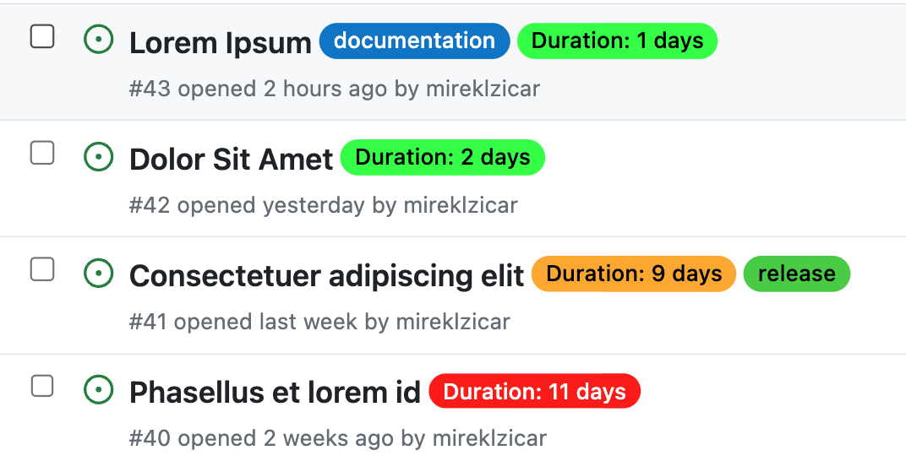

# Issue Duration Labeler

Automatically label issues with their duration and color-code based on configurable thresholds. This GitHub Action helps teams quickly identify how long issues have been open or how long they took to close, improving project management and visibility.



## Input Parameters

| Parameter | Description | Required | Default |
|-----------|-------------|----------|---------|
| `github-token` | GitHub token for authentication | Yes | N/A |
| `short_threshold` | Number of days considered short duration | No | '3' |
| `medium_threshold` | Number of days considered medium duration | No | '10' |
| `short_color` | Color for short duration labels (hex without #) | No | '00FF00' |
| `medium_color` | Color for medium duration labels (hex without #) | No | 'FFA500' |
| `long_color` | Color for long duration labels (hex without #) | No | 'FF0000' |

## Description

The Issue Duration Labeler action scans all issues in your repository (both open and closed) and adds a color-coded duration label to each. The duration is calculated as follows:
- For open issues: from creation date to current date
- For closed issues: from creation date to closed date

Labels are color-coded based on configurable thresholds:
- Short duration (default: ≤3 days): Green
- Medium duration (default: 4-10 days): Orange
- Long duration (default: >10 days): Red

This action can be run on a schedule or triggered manually, allowing you to keep your issues consistently labeled with up-to-date duration information.

## Setup

To use this action in your workflow, add the following YAML to your `.github/workflows/issue-duration-labeler.yml` file:

```yaml
name: Label Issues with Duration

on:
  schedule:
    - cron: '0 0 * * *'  # Run daily at midnight
  workflow_dispatch:  # Allow manual triggering

jobs:
  label-issues:
    runs-on: ubuntu-latest
    steps:
      - uses: mireklzicar/issue-duration@main
        with:
          github-token: ${{ secrets.GITHUB_TOKEN }}
```

## Usage Examples

### Basic usage with default settings

```yaml
- uses: mireklzicar/issue-duration@main
  with:
    github-token: ${{ secrets.GITHUB_TOKEN }}
```

### Custom thresholds and colors

```yaml
- uses: mireklzicar/issue-duration@main
  with:
    github-token: ${{ secrets.GITHUB_TOKEN }}
    short_threshold: '5'
    medium_threshold: '15'
    short_color: '0E8A16'
    medium_color: 'FFA500'
    long_color: 'B60205'
```

---

## Contributing Guidelines

We welcome contributions to the Issue Duration Labeler! Here's how you can help:

1. **Fork the repository** and create your branch from `main`.
2. **Make your changes** and test them thoroughly.
3. **Add or update tests** if necessary.
4. **Ensure your code lints** without errors.
5. **Create a pull request** with a clear title and description.

### Reporting Bugs

If you find a bug, please open an issue with a clear title and description. Include as much relevant information as possible and a code sample or an executable test case demonstrating the expected behavior that is not occurring.

### Suggesting Enhancements

For feature requests, open an issue and outline the feature you'd like to see added. Explain why this feature would be useful to users of the action.

Thank you for contributing to Issue Duration Labeler!
